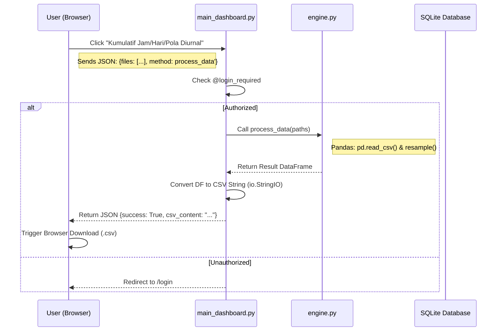
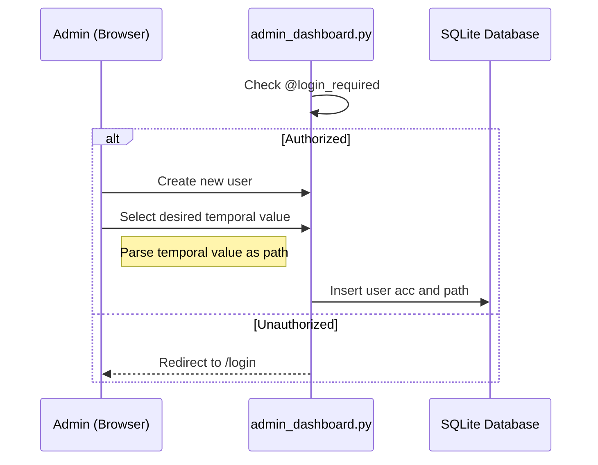
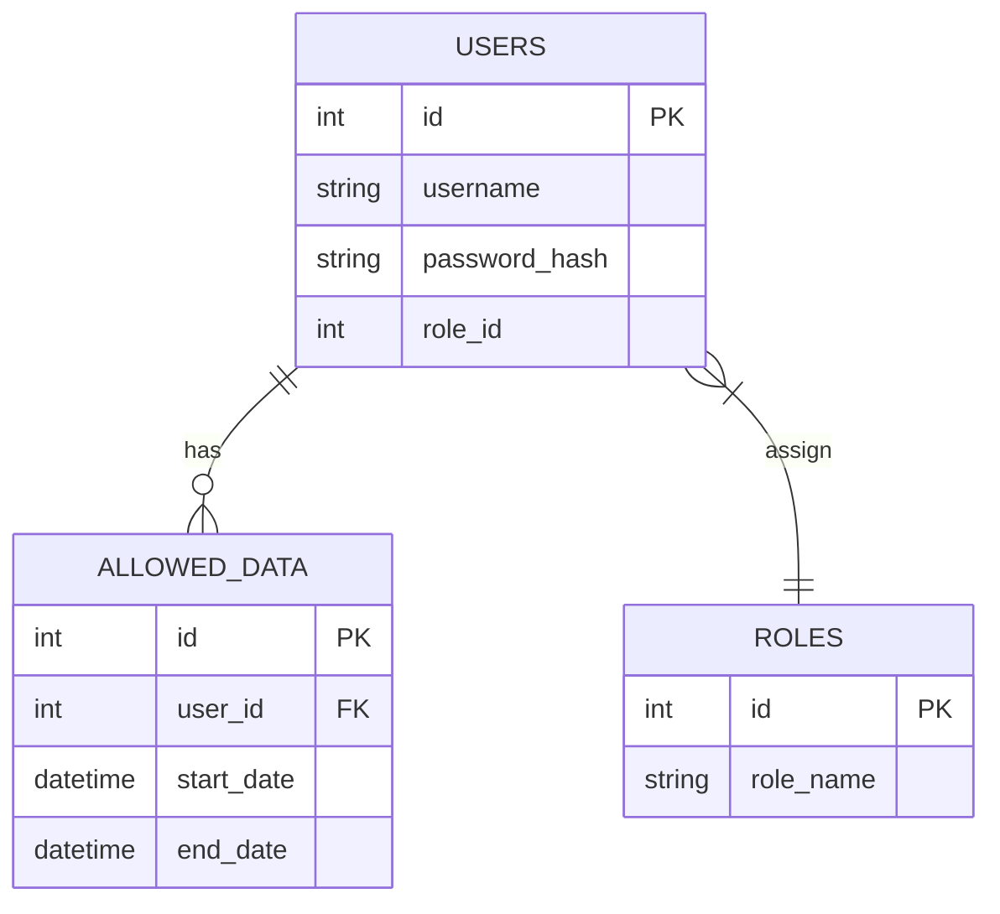

# org-analyzer

Proyek sederhana untuk mengolah data ORG dan menghasilkan tabel csv/xls sebagai output


## 📂 Project Structure

* **`app.py`**: The "Front Door." Handles Flask initialization, user authentication, and login sessions.
* **`main_dashboard.py`**: The "Workroom." Contains the dashboard routes and the `Task Handler` that connects the UI to the engine.
* **`engine.py`**: The "Laboratory." Contains pure Pandas logic for data resampling and calculation. No Flask code lives here. <- TBC
* **`init_db.py`**: A setup script to initialize the SQLite database and seed initial user data.
* **`templates/`**: HTML files (`login.html`, `dashboard.html`).

---

## 🚀 Getting Started

### 1. Prerequisites

Python3.x.

### 2. Install Dependencies

Install library yang dibutuhkan:

```bash
pip install flask flask-login pandas

```

### 3. Initialize the Database

Buat database untuk pertama kalinya:

```bash
python init_db.py

```

### 4. Run the Application

Jalankan Flask:

```bash
python app.py

```

Buka dengan mengunjungi `http://127.0.0.1:5000/login` dari browser.

---

## 🔐 Credentials (Development/Test)

| Username | Password | 
| --- | --- | 
| **admin** | `admin123` | 
| **researcher_john** | `hydro2024` | 

---
## Diagram
### Sequence Diagram User


###Sequence Diagram Admin


### Eentity Relationship Diagram

